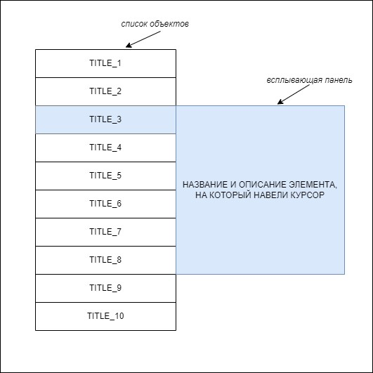

# Тестовое задание на позицию разработчик-JS стажер в компанию [Инфотекс](https://infotecs.ru/) 
## Задание:
На входе имеем массив объектов. Необходимо отобразить их в виде списка (примерный вид приложения ниже). 
При наведении на название элемента из списка, должна появиться панель, в которой будет отображено описание и характеристики выделенного элемента. 
Если ни один из элементов не выделен, всплывающая панель не отображается.

### Основные цели:
* Приложение должно включать в себя минимум два основных компонента (примерный вид приложения см. на рисунке выше):
    1. Вертикальный список с наименованиями элементов – по умолчанию должно отображаться 10 элементов;
    2. Всплывающая панель с параметрами элемента.
*	Данные для списка нужно получать http-запросами с любого fake api (неплохой вариант - [https://dummyjson.com](https://dummyjson.com) (запрос к «/products»), но можно использовать любой другой, либо создать свой на Firebase)
*	Должна быть возможность перетаскивать элементы внутри списка, менять их местами.
### Дополнительные цели:
* Добавить возможность указывать, сколько элементов мы хотим видеть в текущем списке (и, соответственно, отображать столько же).
*	Добавить возможность сортировки элементов по разным параметрам (по имени, по цене и т.п.) – достаточно будет 1-2 параметра.
**Использование фреймворков и библиотек не разрешено. Цель задания – увидеть стилистику кода и ваше мышление. Не забывайте комментировать код, давать переменным и функциям осмысленные названия.**
